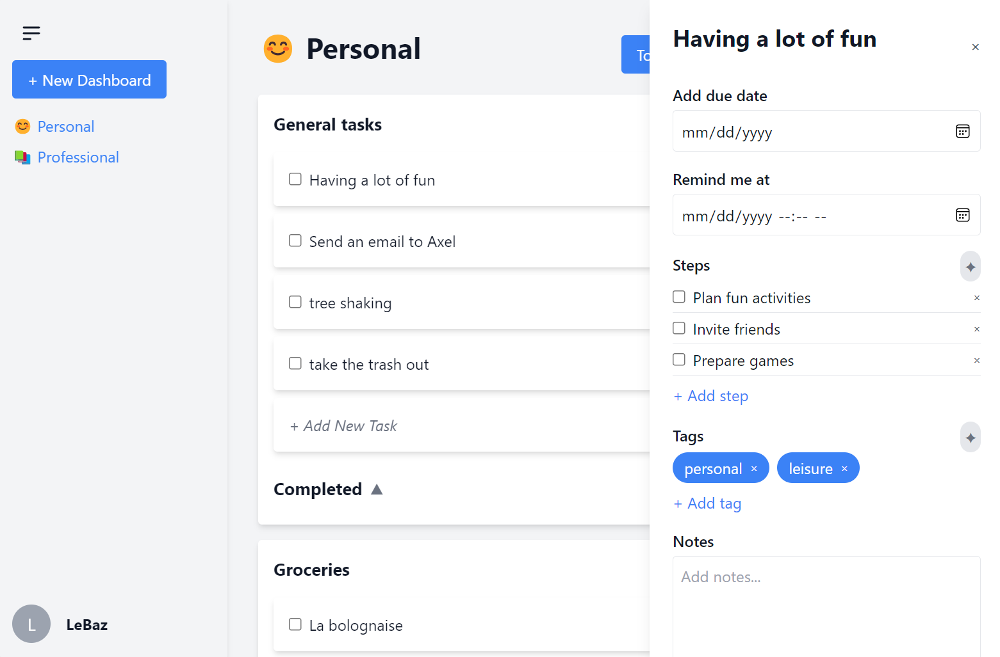

# Dashy

## Overview

Dashy is a modern task and project management application built with Next.js, Prisma, and TypeScript. It provides users with a clean and intuitive interface to manage tasks, dashboards, and conversations. The application also integrates AI-based features through the associated backend service, **dashy-ai**, which enables automatic tagging, subtask generation, and more.

## Features

- **Task Management**: Create, update, and manage tasks with subtasks, due dates, and reminders.
- **Dashboard Management**: Organize tasks into dashboards and task lists.
- **AI Integration**: Automatic generation of tags and subtasks based on task content.
- **Authentication**: Secure login and registration with credential-based authentication.

## Prerequisites

Before running the project, ensure you have the following installed:

- [Node.js](https://nodejs.org/)
- [npm](https://www.npmjs.com/) or [yarn](https://yarnpkg.com/)

## Setup

1. **Clone the Repository**

   ```bash
   git clone <repository-url>
   cd dashy
   ```

2. **Install Dependencies**

   ```bash
   npm install
   # or
   yarn install
   ```

3. **Environment Configuration**

   Create a `.env` file at the root of the project with the following variables:

   ```
   DATABASE_URL=your_database_url
   AI_DATABASE_URL=your_ai_database_url
   NEXTAUTH_SECRET=your_nextauth_secret
   GITHUB_CLIENT_ID=your_github_client_id (optional)
   GITHUB_CLIENT_SECRET=your_github_client_secret (optional)
   ```

   Replace `your_database_url`, `your_ai_database_url`, and `your_nextauth_secret` with your actual database URLs and secret. If using GitHub authentication, also provide the `GITHUB_CLIENT_ID` and `GITHUB_CLIENT_SECRET`.

4. **Database Setup**

   Initialize the Prisma database and run migrations:

   ```bash
   npx prisma migrate deploy
   ```

5. **Start the Development Server**

   ```bash
   npm run dev
   # or
   yarn dev
   ```

   Open [http://localhost:3000](http://localhost:3000) in your browser to see the app.

## Backend Service

The app works in conjunction with the **dashy-ai** backend service, which handles AI-related functionalities. Ensure that the dashy-ai service is running and accessible.

## Screenshot



_Add a screenshot of the app's user interface here._

## Deployment

To deploy the app, you can use platforms like Vercel, which provides easy integration with Next.js. Ensure to configure the environment variables on the deployment platform.

## Contribution

Feel free to contribute to this project by opening issues or submitting pull requests. Please follow the code style and commit message guidelines outlined in the project.

---

_For any questions or issues, please contact the project maintainers._
